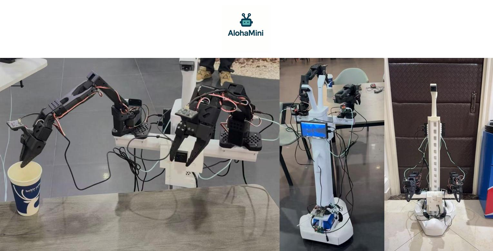

# AlohaMini — Open-Source Dual-Arm AI Robot Kit  

**Affordable. Home-buildable. Fully hackable. Costs less than an iPhone.**

AlohaMini is an **open-source dual-arm mobile robot** for embodied AI, teleoperation, and robotics research.  

Inspired by **ALOHA**, **LeKiwi**, and **Pi-0.5**, it brings real dual-arm manipulation technology to **home labs, makers, and independent researchers** — not just corporations and university labs.

> **Build and control a real dual-arm robot — at home, for the price of a phone.**

Unlike many robots with closed APIs and restricted modification, **AlohaMini is fully open**:  
you can inspect, modify, re-print, and re-program everything. No vendor lock-in. No black boxes.

## 📸 Gallery

  
  

## 🧠 Why AlohaMini?

- **Real dual-arm robot (16 DOF)**
- **Can be built at home** with a consumer 3D printer
- **Cheaper than one iPhone**
- Works with **LeRobot** (teleop + imitation learning)
- Keyboard / voice teleop
- Replace any part — mechanical, firmware, software, AI model
- Designed for **learning, research, hacking, and creative robotics**

> A hardware tool for people who love to **build, modify, and understand** robots — not just watch them.

---

**AlohaMini flips the table**:

> 🔓 **You own it. You control it. You can change anything.**

Modify freely:

- CAD & structural parts  
- Motor logic & firmware  
- Teleoperation interface  
- AI training pipeline  
- OS, compute hardware, sensors  

**A robot engineered by makers, for makers.**

Standing on the shoulders of open robotics pioneers — **ALOHA / LeKiwi / Pi-0.5** — and pushing the idea further:

> **Lab-grade robotics → home-buildable, low-cost, fully open.**

---

## ⚙️ Bill of Materials (BOM)

| Component | Model / Notes | Qty |
|---|---|---|
| Servo motors | Feetech STS3215 (12V bus) | 16 |
| Compute | Raspberry Pi / Linux PC | 1 |
| Battery | 12V Li-ion pack | 2 |
| Cameras | USB cameras | 1–5 |
| Frame | 3D-printed (ABS / PETG / PLA) | — |
| Lift axis | Lead screw + rail （3D-printed）| — |
| Mobility | 3 omni wheels | 3 |

> All parts are inexpensive, widely available, and **DIY-friendly**.
> 
---

## 🧠 Software & Teleoperation

| Layer | Description |
|---|---|
| Framework | **LeRobot compatible** |
| Teleop | Keyboard / Voice |
| Learning | ACT / BC imitation learning |
| Perception | Standard USB cameras |
| Safety | Motor current + lift axis protection |
| OS | Linux / Raspberry Pi |

---

## 📦 Product Line

| Model | Build | Rigidity | Target Users |
|---|---|---|---|
| **AlohaMini** | Fully 3D-printed | Standard | Education, makers, research labs, home builds |
| **AlohaMini Pro** | Hybrid **3D-print + metal** | **3×–5× stiffer** | Advanced labs, startups, heavier payloads |

### AlohaMini Pro Access  
Pro hardware & kits available for research / advanced users.  
📩 **Contact to request early access.**

## 🧑‍🔧 Team
AlohaMini is created by:

- **Li Yiteng**
- **Wu Zhiyong**

## 📬 Contact

Email: liyiteng+github@gmail.com  
WeChat:liyiteng

Videos & tutorials soon on: Bilibili / YouTube / TikTok

---

## 🤝 Contribute

Pull requests, ideas, and forks are welcome.  
Share your build, your mods, and your experiments.

**Star this repo ⭐ if AlohaMini inspires you!**

